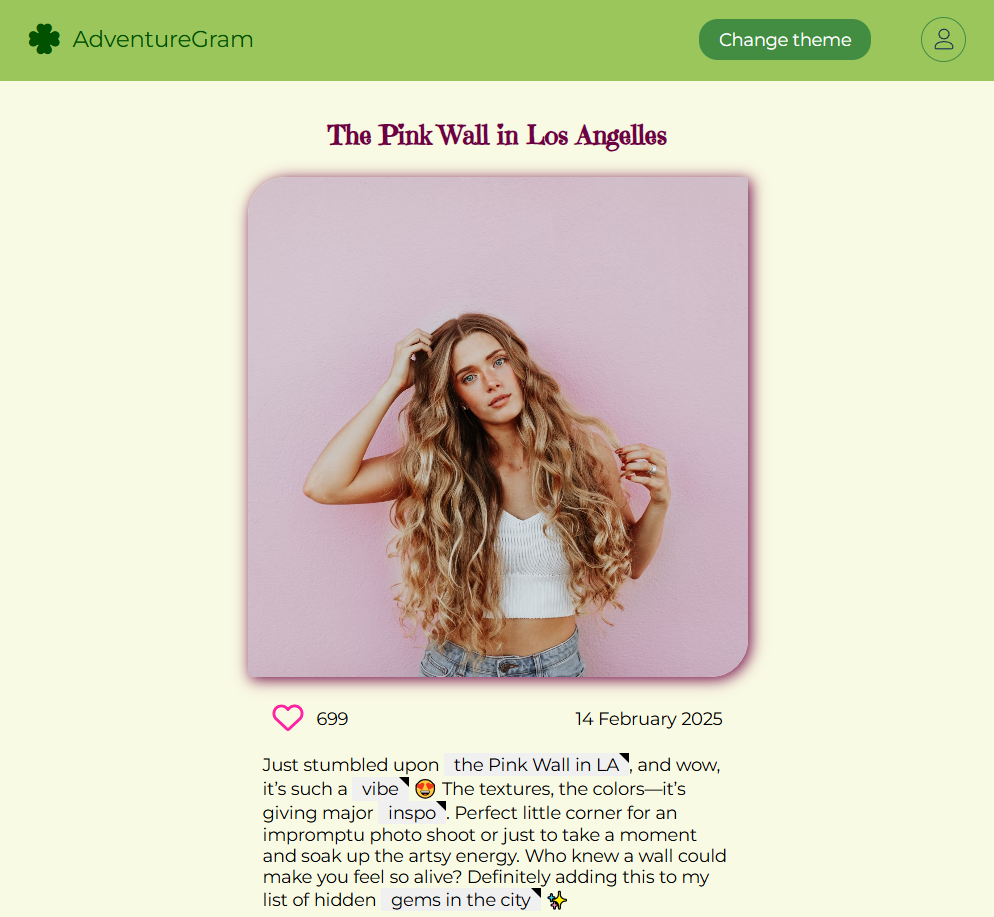
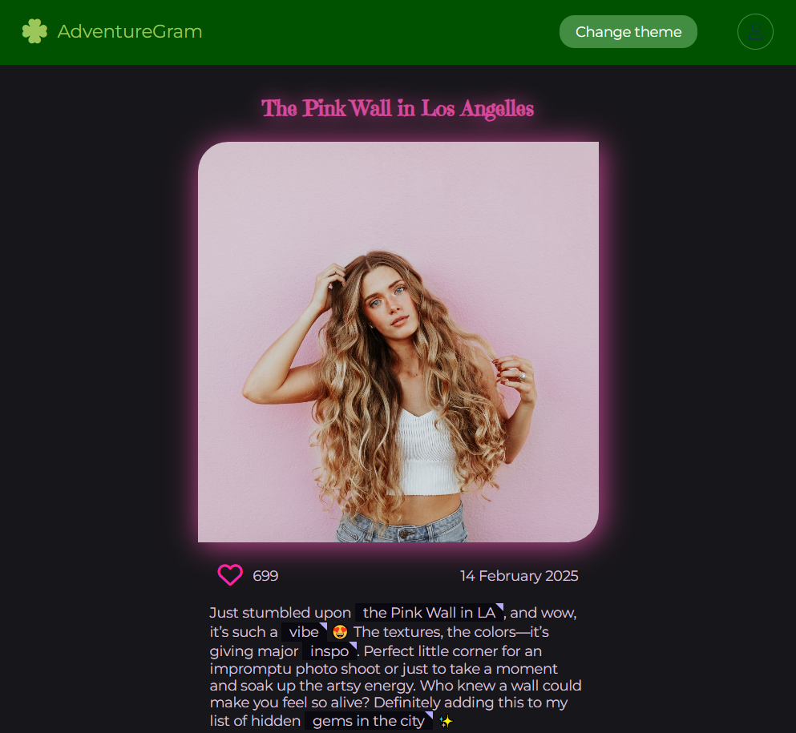
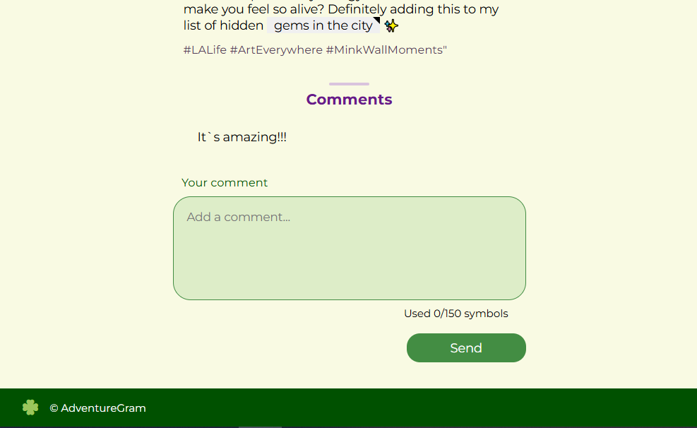
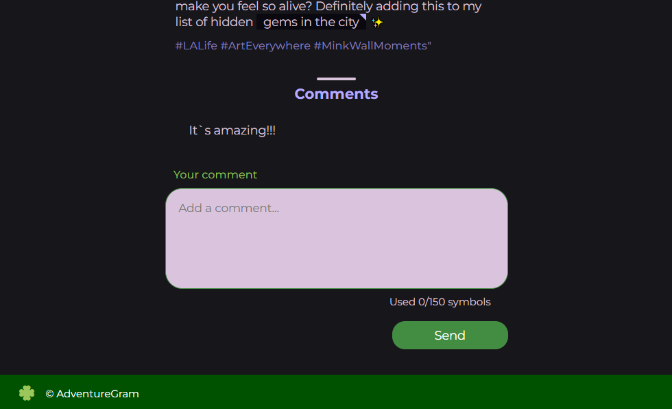

# AdventureGram 📸

[Посмотреть на GitHub Pages](https://helenvirtanen.github.io/adventure-gram/)

AdventureGram — это прототип одного поста в стиле Instagram. Он демонстрирует, как может быть сверстан и интерактивно реализован пост с возможностью поставить лайк и оставить комментарий.

## 📖 Описание
Проект представляет собой статическую страницу с реализацией интерфейса поста, включающего:
- Фото и описание.
- Счётчик лайков с интерактивной кнопкой.
- Форма добавления комментариев.
- Счётчик символов для ввода текста.
- Всплывающие подсказки для отдельных слов.

### 🔑 Основные функции

- **Лайки**: Кнопка для увеличения/уменьшения счётчика лайков.
- **Комментарии**: Возможность оставить комментарий через форму.
- **Ограничение символов**: Ввод текста до 150 символов с предупреждением при превышении.
- **Подсказки (тултипы)**: Всплывающее описание на выделенных словах.

## 🖼️ Скриншоты

### 🌅 Пост с картинкой и описанием
| Светлая тема | Тёмная тема |
|------------|--------------|
|  |  |

### 📄 Комментарии к посту
| Светлая тема | Тёмная тема |
|------------|--------------|
|  |  |


## 📂 Структура проекта

```plaintext
AdventureGram/
├── css/
│   └── style.css         # Основные стили
├── js/
│   ├── themes.js         # Логика смены темы
│   ├── likes.js          # Логика работы лайков
│   ├── comments.js       # Логика добавления комментариев
│   └── tooltip.js        # Логика работы тултипов
├── index.html            # Основная страница
└── README.md             # Документация


## 🛠️ Применяемые технологии
* HTML
* CSS (включая резиновую и адаптивную верстку)
* JavaScript

## 🚀 Установка и запуск
**1. Клонировать репозиторий**
```bash
git clone https://github.com/HelenVirtanen/adventure-gram
```

**2. Запустить**
* Открыть проект в VS Code.
* Убедиться, что установлен плагин Live Server.
* Нажать "Go Live" в правом нижнем углу редактора.
